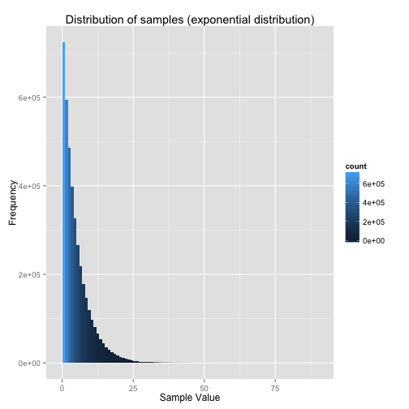
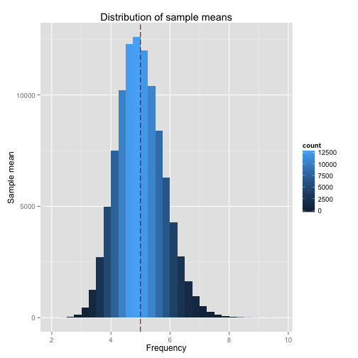

# Overview

This paper investigates the exponential distribution in R and compares it with 
the Central Limit Theorem.  

# Simulations


```r
lambda <- 0.2     # Lamdba
n <- 40           # Number of exponentials
numsim <- 100000  # Number of simulations
```

We simulate an exponential distribution using `rexp`, with 40 exponentials 
and lamda of 0.2. The simulation is performed 
100000 times.  The code below shows the 
simulation in action:


```r
sim <- matrix(rexp(n * numsim, lambda), numsim) 
```

# Sample Mean versus Theoretical Mean

The code below computes the sample mean from the simulated data.


```r
mean.theoretical <- 1/lambda
means.sim <- apply(sim, 1, mean)
mean.sim <- mean(means.sim)
mean.error <- abs(mean.sim - mean.theoretical) / mean.theoretical * 100
```

The sample mean is **4.998943** while the theoretical mean is 
**5**. This is an error of **0.02113725%**. This
clearly shows that the Central Limit Theorem in action as the mean of the
simulated means is almost the same as the theoretical mean.

# Sample Variance versus Theoretical Variance

The sample variance can be computed using the code show below:


```r
sd.theoretical <- 1/lambda
var.theoretical <- sd.theoretical ^ 2
sds.sim <- apply(sim, 1, sd)
sd.sim <- mean(sds.sim)
var.sim <- sd.sim ^ 2
var.error <- abs(var.sim - var.theoretical) / var.theoretical * 100
```

The average sample variance is **23.84522** (standard deviation of 
4.883157) while the theoretical variance is 
**25** (standard deviation of 5). 
This is an error of **4.619125%** in the variance.

# Distribution

The plot below shows the distribution of the _simulated samples_.


```r
library(ggplot2)
g <- ggplot(data.frame(x = as.vector(sim)), aes(x = x)) +
    geom_histogram(aes(fill = ..count..), binwidth = 1) +
    ggtitle("Distribution of samples (exponential distribution)") +
    xlab("Sample Value") +
    ylab("Frequency") 
print(g)
```

 

The histogram below shows the distribution of the _sample means_. The red 
vertical dashed line is the mean of the sample means and is at 4.9989431.


```r
g <- ggplot(data.frame(x = means.sim), aes(x = x)) +
    geom_histogram(aes(fill = ..count..), binwidth = 0.25) +
    ggtitle("Distribution of sample means") +
    xlab("Frequency") +
    ylab("Sample mean") +
    geom_vline(xintercept = mean.sim, colour = "darkred", linetype = "longdash")
print(g)
```

 

Looking at the histogram above, the distribution of the sample means appears
to be close to a normal distribution.

