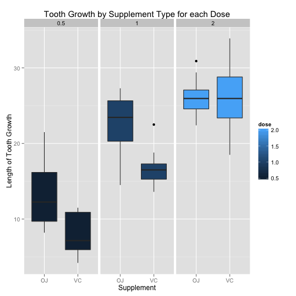

# Overview

The report analyzes the ToothGrowth dataset in R.

# Summary of the Tooth Growth dataset

The _Tooth Growth_ dataset in R shows the effect of Vitamin C on tooth growth
in guinea pigs. The data provides is the length of odontoblasts (teeth) in 
each of 10 guinea pigs at each of three dose levels of Vitamin C (0.5, 1, and 
2 mg) with each of two delivery methods (orange juice or ascorbic acid).

The data contains three variables:

Variable | Data Type | Description
---------|-----------|------------
`len`    | `numeric` | Tooth length
`supp`   | `factor`  | Supplement type (VC or OJ)
`dose`   | `numeric` | Dose in milligrams

The dataset contains a total of 60 observations. Here's a
summary of the raw data. 


```r
summary(ToothGrowth)
```

```
##       len        supp         dose      
##  Min.   : 4.20   OJ:30   Min.   :0.500  
##  1st Qu.:13.07   VC:30   1st Qu.:0.500  
##  Median :19.25           Median :1.000  
##  Mean   :18.81           Mean   :1.167  
##  3rd Qu.:25.27           3rd Qu.:2.000  
##  Max.   :33.90           Max.   :2.000
```

The plot below shows the tooth growth ranges for each dosage level of each 
supplement.


```r
library(ggplot2)
g <- ggplot(ToothGrowth, aes(x = supp, y = len, fill = dose)) +
    geom_boxplot() +
    facet_grid(. ~ dose) + 
    ggtitle("Tooth Growth by Supplement Type for each Dose") +
    xlab("Supplement") +
    ylab("Length of Tooth Growth") 
print(g)
```

 

# Tooth growth analysis by supplement

Use confidence intervals and/or hypothesis tests to compare tooth growth by supp and dose. (Only use the techniques from class, even if there's other approaches worth considering)
State your conclusions and the assumptions needed for your conclusions. 

# Tooth growth analysis by dose

Use confidence intervals and/or hypothesis tests to compare tooth growth by supp and dose. (Only use the techniques from class, even if there's other approaches worth considering)
State your conclusions and the assumptions needed for your conclusions. 


Did the student perform some relevant confidence intervals and/or tests?
Were the results of the tests and/or intervals interpreted in the context of the problem correctly? 
Did the student describe the assumptions needed for their conclusions?
